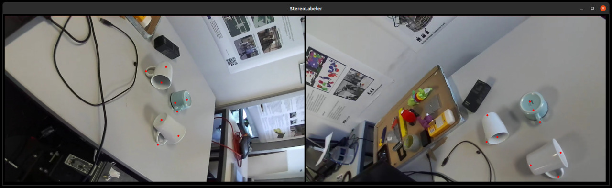

# Object Keypoint Tracking

This repository contains a toolkit for collecting, labeling and tracking object keypoints. Object keypoints are semantic points in an object's coordinate frame.

The project allows collecting images from multiple viewpoints using a robot with a wrist mounted camera. These image sequences can then be labeled using an easy to use user interface, StereoLabel.



Once the images are labeled, a model can be learned to detect keypoints in the images and compute 3D keypoints in the camera's coordinate frame.

## Installation

External Dependencies:
- [HUD](https://github.com/ethz-asl/hud) (only for non-qt version)
- ROS melodic/noetic

Install HUD. 

### conda

The preferred way of installation is with miniconda.
Just set `export OBJECT_KEYPOINTS_DIR=<dir>` to your directory and run
```bash
scripts/install.sh
```

### pip3

Alternatively, you can install via pip3.
Install dependencies with `pip install -r requirements.txt` and finally install the package using `pip3 install -e .`.

Also install the files in [`perception/corner_net_lite/core/models/py_utils/_cpools`](perception/corner_net_lite/core/models/py_utils/_cpools) by issuing `python3 setup.py install --user` in that folder.

## Usage

Here we describe the process we used to arrive at our labeled datasets and learned models.

### Calibration and setup

First, calibrate your camera and obtain a hand-eye-calibration. Calibrating the camera can be done using [Kalibr](https://github.com/ethz-asl/kalibr). Hand-eye-calibration can be done with the [ethz-asl/hand_eye_calibration](https://github.com/ethz-asl/hand_eye_calibration) or [easy_handeye](https://github.com/IFL-CAMP/easy_handeye) packages.

The software currently assumes that the Kalibr `pinhole-equi` camera model was used when calibrating the camera.

Kalibr will spit out a yaml file like the one at `config/calibration.yaml`. This should be passed in as the `--calibration` argument for `label.py` and other scripts.

Once you have obtained the hand-eye calibration, configure your robot description so that the tf tree correctly is able to transform poses from the base frame to the camera optical frame.

### Collecting data

To collect the data, run `scripts/record_keypoints_bag.sh <path-to-output-dir> <recording-name> <mode=default>` in the `moma_sensor_tools` package.
Check in the file that only topics you want get recorded, but the default settings should be fine as well.

#### Deprecated approach

The script `scripts/collect_bags.py` is a helper program to assist in collecting data. It will use [rosbag](http://wiki.ros.org/rosbag) to record the camera topics and and transform messages.

Run it with `python3 scripts/collect_bags.py --out <path-to-bag-output-folder>`.

Press enter to start recording a new sequence. Recording will start after a 5 second grace period, after which the topics will be recorded for 30 seconds. During the 30 seconds, slowly guide the robot arm to different viewpoints observing your target objects.

### Encoding data

Since rosbag is not a very convenient or efficient format for our purposes, we encode the data into a format that is easier to work with and uses up less disk space. This is done using the script `scripts/encode_bag.py`.

Run it with `python3 scripts/encode_bags.py --bags <path-to-bag-output-folder> --out <path-to-dataset-output> --calibration <path-to-kalibr-calibration.yaml>`.

### Labeling data


First decide how many keypoints you will use for your object class and what their configuration is. Write a keypoint configuration file, like `config/valve.json` and `config/cups.json`. For example, in the case of our valve above, we define four different keypoints, which are of two types. The first type is the center keypoint type and the second is the spoke keypoint type. For our valve, there are three spokes, so we write our keypoint configuration as:
```
{ "keypoint_config": [1, 3] }
```
What this means, is that there will first be a keypoint of the first type and then three keypoints of the next type. Save this file for later.

StereoLabel can be launched with `python3 scripts/label.py <path-to-dataset-folder>`. To label keypoints, click on the keypoints in the same order in each image. Make sure to label the points consistent with the keypoint configuration that you defined, so that the keypoints end up on the right heatmaps downstream.

If you have multiple objects in the scene, it is important that you annotate one object at the time, sticking to the keypoint order, as the tool makes the assumption that one object's keypoints follow each other. The amount of keypoints you label should equal the amount of objects times the total number of keypoints per object.

Once you have labeled an equal number of points on the left and right image, points will be backprojected, so that you can make sure that everything is correctly configured and that you didn't accidentally label the points in the wrong order. The points are saved at the same time to a file `keypoints.json` in each scene's directory.

Here are some keyboard actions the tool supports:
- Press `a` to change the left frame with a random frame from the current sequence.
- Press `b` to change the right frame with a random frame from the current sequence.
- Press `<tab>` to go to next sequence, after you labeled a sequence.

Switching frames is especially useful, if for example in one viewpoint a keypoint is occluded and it is hard to annotate accurately.

Once the points have been saved and backprojected, you can freely press `a` and `b` to swap out the frames to different ones in the sequence. It will project the 3D points back into 2D onto the new frames. You can check that the keypoints project nicely to each frame. If not, you likely misclicked, the viewpoints are too close to each other, there could be an issue with your intrinsics or hand-eye calibration or the camera poses are not accurate for some other reason.

### Checking the data

Once all your sequences have been labeled, you can check that the labels are correct on all frames using `python scripts/show_keypoints.py <path-to-dataset-folder>`, which will play the images one by one and show the backprojected points.

### Learning a model

First, download the weights for the CornerNet backbone model. This can be done from the [CornerNet repository](https://github.com/princeton-vl/CornerNet-Lite). We use the CornerNet-Squeeze model. Place the file at `models/corner_net.pkl`.

You can train a model with `python scripts/train.py --train <path-to-training-dataset> --val <path-to-validation-dataset>`. Where `--train` points to the directory containing your training scenes. `--val` points to the directory containing your validation scenes.

Once done, you can package a model with `python scripts/package_model.py --model lightning_logs/version_x/checkpoints/<checkpoint>.ckpt --out model.pt`

You can then run and check the metrics on a test set using `python scripts/eval_model.py <path-to-dataset> --model model.pt --keypoints <keypoint-config>`.

## General tips

Here are some general tips that might be of use:
- Collect data at something like 4-5 fps. Generally, frames that are super close to each other aren't that useful and you don't really need every single frame. I.e. configure your camera node to only publish image messages at that rate.
- Increase the publishing rate of your `robot_state_publisher` node to something like 100 or 200.
- Move your robot slowly when collecting the data such that the time synchronization between your camera and robot is not that big of a problem.
- Keep the scenes reasonable.
- Collect data in all the operating conditions in which you will want to be detecting keypoints at.


